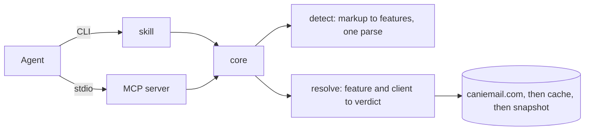

<div align="center">

<picture>
  <source media="(prefers-color-scheme: dark)" srcset="assets/banner-dark.svg">
  
</picture>

An agent skill and an MCP server that check HTML email against caniemail.com.

[![CI][ci-badge]][ci]
[![License][license-badge]][license]

---

<a href="#install"><kbd>&nbsp;<br>&nbsp;&nbsp;&nbsp;Install&nbsp;&nbsp;&nbsp;<br>&nbsp;</kbd></a>
<a href="#quickstart"><kbd>&nbsp;<br>&nbsp;&nbsp;&nbsp;Quickstart&nbsp;&nbsp;&nbsp;<br>&nbsp;</kbd></a>
<a href="#the-tools"><kbd>&nbsp;<br>&nbsp;&nbsp;&nbsp;Tools&nbsp;&nbsp;&nbsp;<br>&nbsp;</kbd></a>
<a href="#four-verdicts-not-a-boolean"><kbd>&nbsp;<br>&nbsp;&nbsp;&nbsp;Verdicts&nbsp;&nbsp;&nbsp;<br>&nbsp;</kbd></a>
<a href="#how-it-works"><kbd>&nbsp;<br>&nbsp;&nbsp;&nbsp;How it works&nbsp;&nbsp;&nbsp;<br>&nbsp;</kbd></a>

---

</div>

<picture>
  <source media="(prefers-color-scheme: dark)" srcset="assets/demo-lint-dark.svg">
  
</picture>

## Why this project?
Email clients are not browsers.
Outlook on Windows renders with Microsoft Word, and the gap between "works with a workaround" and "nobody has ever tested this" decides whether an email ships broken.
[caniemail.com](https://www.caniemail.com) has the data, and this puts it where an agent can use it while it writes.

- **Lint a draft.** Pass HTML and CSS, get back only what breaks, with line and column for every use.
- **Check one feature.** Per-client verdicts for `css-display-flex` cost about 200 tokens instead of a 620KB dataset.
- **Find the slug.** Search "rounded corners" and get `css-border-radius`.
- **Read the workaround.** A `mitigated` verdict carries the note that says how, such as VML `RoundRect` for corners in Outlook.
- **See the data's age.** Every result names its source (live, cache or bundled snapshot) and when each feature was last tested.

## Which one to use

The skill and the MCP server share one core and answer identically.
Pick by where your agent runs.

| Your client | Use | Why |
| --- | --- | --- |
| An agent that runs commands on your machine: Claude Code, Codex CLI, OpenClaw, Cursor, Zed | the skill | It carries the authoring rules too, so the agent writes compatible markup first instead of only checking it afterwards. |
| A desktop chat app that spawns MCP servers, such as Claude Desktop | the MCP server | A desktop chat has no shell, but it does start MCP servers on your machine over stdio. |
| A hosted session, a browser chat or a cloud agent | the MCP server, hosted by you | A cloud session cannot reach a process on your machine, and there is no public instance. |

## Install

### Skill

[![Node][node-badge]][node]
[![ClawHub][clawhub-badge]][clawhub]
[![skills.sh][skills-badge]][skills]

Install it into `.agents/skills/` in the current project, or add `-g` for `~/.agents/skills/`:

```bash
npx skills add shbernal/caniemail-ai-tooling
```

The skill has no dependencies, so there is nothing to install after it.

### MCP server

[![Node][node-badge]][node]
[![npm][npm-badge]][npm]

Add this to your client's MCP config:

```json
{
  "mcpServers": {
    "caniemail": {
      "command": "npx",
      "args": ["-y", "mcp-server-caniemail"]
    }
  }
}
```

Its only dependencies are the MCP SDK and `zod`.
Set `CANIEMAIL_OFFLINE=1` in its environment to skip the network and use the bundled snapshot.

## Quickstart

1. Install the skill or the server as above.
2. Ask your agent for an email, and name the clients that matter: "Build an order confirmation email. It has to work in Outlook on Windows and Gmail."
3. The agent drafts the markup, calls `lint_email` against those clients, and rewrites whatever comes back `unsupported`.

The skill also ships a CLI, which is what the agent runs and works the same by hand:

```bash
node skill/scripts/caniemail.mjs lint --html draft.html --clients 'outlook.windows,gmail.*'
```

Client lists take `family.platform` globs: `outlook.windows`, `gmail.*`, `*.ios`, or `*` for every client.

## The tools

Three tools, deliberately not one.
A single "give me the caniemail data" tool would return 620KB of JSON, about 300 features across 48 clients, and fill an agent's context before it did anything useful.

| Tool | Use it to | Typical cost |
| --- | --- | --- |
| `lint_email` | Check a draft before sending. Returns only findings, with positions, affected clients and workarounds. | about 10k tokens for a realistic newsletter against all 48 clients |
| `check_feature_support` | Decide how to build something. One feature, a verdict per client. | about 200 tokens |
| `search_features` | Find a slug by keyword. Agents can't guess that flexbox is `css-display-flex`. | a few hundred tokens |

A fourth, `list_email_clients`, is rarely needed, because the client roster is already in the other tools' descriptions.

## Four verdicts, not a boolean

<picture>
  <source media="(prefers-color-scheme: dark)" srcset="assets/verdicts-dark.svg">
  
</picture>

The dataset distinguishes four states, and collapsing them gives confidently wrong advice.

| Verdict | Meaning |
| --- | --- |
| `supported` | Use it. |
| `unsupported` | Will not render. Use a fallback. |
| `mitigated` | Works with a documented workaround. The note is the answer. |
| `untested` | No data. Not evidence of support, and not evidence against it. |

About a sixth of the matrix is untested, and some entries have not been retested in five years.
Every result carries `last_test_date`, and `check_feature_support` adds a staleness note when the data is old.

## Why not the `caniemail` package?

This started as a wrapper over the [`caniemail`](https://github.com/shellscape/caniemail) npm package.
It stopped being one because the package gives wrong answers on exactly the parts of the data an agent needs most.

| | `caniemail` package | This project |
| --- | --- | --- |
| Untested cells | Reported as `partial`, which is 900 of its 1,637 partial verdicts | Reported as `untested` |
| Version order | Re-sorted, so 280 cells use the wrong version (`outlook.macos` picks 2016 over 16.80) | Taken as authored |
| Missing data, 16% of pairs | Throws `RangeError`, so `['*']` always fails | Answers `untested` |
| Parses per document | 48, one per client | 1 |
| Features found on the test corpus | 267 | 392 |
| CSS inside `@media` | Not seen | Seen |
| Line numbers inside `<style>` | Relative to the block | Relative to the document |
| Runtime dependencies | 28 MB | None |
| Dataset | Bundled, 68 days behind the site when last checked | Fetched live, with a snapshot as fallback |

[docs/why-not-a-wrapper.md](docs/why-not-a-wrapper.md) has the full account of each defect.
The package stays a devDependency, because a differential test suite checks every fixture against it.

## How it works



One core, `core/caniemail-core.mjs`, does all the work.
The skill and the MCP server each carry a byte-identical copy of it, so they cannot drift apart.

Detection answers "what does this markup use?" without asking about any client.
Resolution answers "does this client support it?" against the raw dataset, keeping all four verdicts and never re-sorting versions.

The dataset comes from caniemail.com at runtime and is cached for a day.
A response that doesn't look like the dataset is rejected, and the core falls back to the cache, then to the snapshot in `core/data/caniemail.json`.
The MCP server revalidates every 15 minutes, so an editor left open for a week does not keep reporting its first load as live.

## Scope

Rendering only, meaning whether markup displays correctly in a given client.
Deliverability, SPF, DKIM, DMARC, BIMI, list management and choosing an ESP are different problems, and caniemail data cannot answer them.

## More

- [CONTRIBUTING.md](CONTRIBUTING.md) for setup, tests, and the vendoring rule.
- [CHANGELOG.md](CHANGELOG.md) for what changed in each release.
- [docs/releasing.md](docs/releasing.md) for how both surfaces get published.
- [skill/SKILL.md](skill/SKILL.md) for the authoring rules the skill gives an agent.

The caniemail dataset is a separate work, MIT, © 2019 Rémi Parmentier.
The `caniemail` npm package, used here only as a development-time reference, is MIT, © Andrew Powell.

[npm]: https://www.npmjs.com/package/mcp-server-caniemail
[npm-badge]: https://img.shields.io/npm/v/mcp-server-caniemail?style=for-the-badge&label=mcp-server-caniemail&color=CB3837&logo=npm&logoColor=white
[ci]: https://github.com/shbernal/caniemail-ai-tooling/actions/workflows/ci.yml
[ci-badge]: https://img.shields.io/github/actions/workflow/status/shbernal/caniemail-ai-tooling/ci.yml?branch=main&style=for-the-badge&logo=githubactions&logoColor=3fb950&label=ci&labelColor=0d1117&color=3fb950
[license]: LICENSE
[license-badge]: https://img.shields.io/github/license/shbernal/caniemail-ai-tooling?style=for-the-badge&labelColor=0d1117&color=d29922
[node]: https://nodejs.org
[node-badge]: https://img.shields.io/badge/node-%E2%89%A524-5FA04E?style=for-the-badge&logo=nodedotjs&logoColor=white
[clawhub]: https://clawhub.ai/shbernal/skills/email-compat
[clawhub-badge]: https://img.shields.io/badge/dynamic/json?url=https%3A%2F%2Fclawhub.ai%2Fapi%2Fv1%2Fskills%2Femail-compat&query=%24.latestVersion.version&prefix=v&label=email-compat&labelColor=555555&style=for-the-badge&color=F5654A&logo=data%3Aimage%2Fpng%3Bbase64%2CiVBORw0KGgoAAAANSUhEUgAAABwAAAAcCAYAAAByDd%2BUAAAG%2BklEQVRIx22WW4idVxXHf2vt%2FZ37mcuZdHKZpM29iQZEWoRiqb1QKFotKlRbaPVV%2B%2BaLRbC%2B9kH0QfC94AWhoFQUhaIUq0FL2wltY5qmmUkmmcxMZpK55HzfOd%2F37b18ODNnZmw3LDh8rLP%2F67%2F3f%2F33EoBDBw7Q6%2FVxztFNU7751afk72%2F8rdHLMgVBVRBVBAEBEQHAzBgu2%2F5Rq9fj0089lf7ylVes1WxRlCXHWm3Ozl5GvnDffbw7PU2j0aDVajV6We8JM%2FuyYEcwEkRwqgNAEQZYws5lZjsiAhQgM4j8uV6v%2F6WbdtOs12Oi00FajSYCJIk%2FUJThZTN7GrMqCE4MVcHE4dQNmG6y2ySLGcRohBhRAhaNIoIMTqKvqr%2BrVio%2FLMpyATN8pVLBqTbSLHs5xviciNBKjEeOCt6XLK0a4j3nVxK6ueJUdjA0QjTa1chn7iqJRcFkS3Dqef1jWO1LVUJ4PoQQW83mC2UZUhdDJMT4ZBnKnwC%2BIZFv7yt54ajw3o2SvaNVHhiH%2BycKLmXCajqgZTZgdWjUeOF4yZGKEZzC7ZIfHBa0V3J%2BA3oRzOKpEOJ0r9%2B%2FoI8%2B%2FCUNITxp0apqxr2U3L0Ymb9SkBeRx08kHD%2FaIV0p%2Bd7xkk4rEswIZtzVNr5%2FFG4t5pw8PsYTJxyaR%2BZnSw7OR87EEo2REGKtDOWXf%2Fzii6LvnDtXM7O7oxkdCzT7kZkU5u4Y1apwsppz0nve7XuWFguePmX4RPAJfOOEcfF6xnSpnKpUOO0H%2F%2Flww3ivZ7h%2BZCJGohmhDPf89Oc%2Fq2kZgpiZAoxiLAEzGJcy47TC5Fs5%2FdkUU3h1SZgkZ2oCpjowEnJeu2W4BPK5HpPv9Dnh4ULXuBjhGtCWuKVkX4agfkvaAqiH2wF6BnvX4PAanKvAh5V1lrPAXE95a77k1GiOYUwvB5Zyz0oa%2BNfyGkevgfWNFYOrQC4w5kCCIepotVp4NpvXgNCAkQjXcjjbh3UxFg5FrmQ5s%2BuOQ21Ql9C83keAtJNwcAyu3BH%2B0cq5NAkXLsMHBsvAQQdFAlYyFJnudIrVIIzsEVoCEViqwEdiXEwFnHFvR%2FjaY4c4saGcTh2PPrCPY20jKlzoCh9hLCQQgLbASEdYQ7FNc%2BhnGX7oTmIsd4XRpnB8LywtGMcK%2BOKo8vqooD1j4aOcuflZHsoiTuCNV6%2BznAamOsr%2BSXjIhDdnjDtA5y646ZSVniCbvici6I4exhAu33TQFCojcDHC4nljdCXi70QqBUysBk4anIwwtRbRAmwjMn7LWPivMRPBN0Hqysyy7rJA9R4%2FwLIhqplyftnx4DFYmI%2F8%2FrZRvQb9OLjnDWBtM%2FsGxgqQZPD%2BVaOr0JqAqUnh7HXFTIaurqo0mk12l2AgYqylwhuXHPsPKY8%2FIDQnwcWBEN4GPjBj2uCfwDpQEWjvgcc%2FLxw4qLw551jPFJFtU98C9kMzHjo%2FqMJGT3l7Fo6cCIzXoRDjWA069wjdcaUA9t6KHLtqhBz2NAQX4N1ryp2%2BQzB2vV5mFHmO2rAttqoYJKrAcleYi7BvHPyYkOYQrxunbxgnb0CYN7J8cGcTozCvws1UUfnEI0mMke7GBmoMcbBhDI6hKIX%2FXFGoQhiD%2BhjcFJipweVa5LaH5tigGKnD2TmlLHe%2BjztBBfVu0PjG%2F69Bsggs3BJ%2BPS10%2B%2FDZEbCKsXTHyBWkAquF8OEN4dxtyPr6yZ1s8%2FQMYhnwnwIFtvWyQzRhI1VMDF%2BHEQXXFlBobBjOCeWqsJ4KTndPAEN2BqKCT5LtO9wG22K4GRgVhftHjWcDTBTQzw3rGXdnwncU7t9jVOSTYLtFE8myFHWqJhC3wRgmmhlqxj6LNNcjyzeNmocHF%2BChRWhUYP2GMbIWmbKIfArYFiERKWu1evSPPfJw9ofX%2FnhFogxZCjJIFKgadMz4OMBSxZhagY10UNuFAq4JrPVhUo1FIimyo%2FBtiqI6%2B9KPXuqJUyVJkq8XRfFbjOr2gDQoQIGjEpkAet5YKaEMA3OveRj3UC%2BFFRM%2BRoi2W3ib%2B%2FWSJPlWURSvuZFWm2qlerUsyiNm9rlhRVuzJ3ALYQmh54WJMdCmUG1AvS7Ml47ZUrhpskvtO%2B%2FPeferZqP5i8T70qlTiiIvksT%2F28wmDU7BQL07Z9AokEXldk%2FpB6GbK4upkJZC%2FJSW2iy677z7Tb1efzHP89UQInJmcpL3l5aoVSo0W61GlmVPhDJ8JcZ42CwmW4DbDiiDDWXnOGzs0BwiUqjqjHPuT41G469pmqa9fp%2F9B%2FYPEg6eOUOjVmN0ZASvjmeeeVbH2u1mzfv2VtS3wvl2zfl23bnNb0m77gbf696360nSHmu1m9997nnx6hgfHaXZaHDk8GEA%2FgcKL8ikX%2BEcEAAAAABJRU5ErkJggg%3D%3D
[skills]: https://skills.sh/shbernal/caniemail-ai-tooling
[skills-badge]: https://img.shields.io/endpoint?url=https%3A%2F%2Fwww.skills.sh%2Fapi%2Fbadge%2Fshbernal%2Fcaniemail-ai-tooling&style=for-the-badge&label=skills.sh%20installs
